# Integracja Allegro i SubiektGT ze Sferą - zamówienia, faktury sprzedaży, paragony i produkty

## Wstęp

### Wprowadzenie

Repozytorium dotyczy aplikacji umożliwiającej przede wszystkim pobranie zamówień z Allegro i późniejsze zapisanie ich w Subiekcie w postaci faktur sprzedaży albo 
zwykłych paragonów. W aplikacji można zaznaczyć wiele zamówień pobranych z Allegro i następnie jednym kliknięciem dodawane są do Subiekta faktury albo zwykłe paragony. 
Dodatkowo po utworzeniu zamówień Allegro w Subiekcie w formie faktury albo paragonu można jeszcze w aplikacji Integracja dla wybranych zamówień w Allegro przypisać dokumenty sprzedaży otrzymane
 w Subiekt GT. Aplikacja wspiera oferty z Allegro w wielu konfiguracjach:
* Jeden produkt,
* Zestaw jednego produktu np. 10 sztuk produktu,
* Zestaw wielu produktów.

Dodatkowo w aplikacji Integracja można przeglądać oferty obecne w Allegro wraz z informacjami, czy znaleziono analogiczny produkt w Subiekcie. Również w razie
potrzeby, w aplikacji można zapisać oferty pobrane z Allegro do pliku i następnie można te oferty szybko dodać do Subiekt GT w postaci towaru albo zestawu towarów.

### Sfera

#### Wprowadzenie
Aplikacja Integracja korzysta z dodatku Sfera do Subiekt GT i dzięki temu można szybko dodać pożądane dokumenty do Subiekta. Wtyczka Sfera umożliwia uruchomienie 
w Subiekcie kanału komunikacyjnego, poprzez który aplikacje mogą się w sposób bezpośredni komunikować z Subiektem. Technicznie otwierane jest API typu COM, które 
jest technologią najczęściej używaną w C#. Dodatek mocno usprawnia integrację, gdyż nie trzeba bazować na plikach i opcji Dodaj na podstawie. Niestety mechanizm ten jest dodatkowo płatny, lecz chociaż zakup jest jednorazowy.

#### Nakładka na Sferę

Jak wspomniałem Sfera jest raczej związana z językiem C#. Ja niestety nie znam za bardzo tego języka i ograniczyłem się do Javy. Dlatego wykorzystałem nakładkę 
na Sfere napisaną przez kogoś innego w php. Wtyczka jest zamieszczona na[repozytorium GitHub Lukegpl](https://github.com/Lukegpl/api-subiekt-gt?tab=readme-ov-file).

Nakładka ta okazała się całkiem dobra. Przede wszystkim używa REST i JSON oraz jest dosyć dobrze 
[udokomentowana](https://github.com/Lukegpl/api-subiekt-gt/wiki/API-Dokumentacja-v.-1.0). Są szczegółowe informacje o realizowanych funkcjach np. jakie dane są wymagane 
dla poszczególnych endpointów oraz co prawdopodobnie będzie zwrócone. Niestety musiałem też trochę przerobić kod tej nakładki, aby spełniała moje potrzeby 
np. wprowadziłem tworzenie klienta jednorazowego przy zapisywaniu faktur sprzedaży i zwykłych paragonów, a we wcześniejszej wersji nakładki,
klienci musieli już istnieć w Subiekcie przed dodaniem nowych obiektów. Dodatkowo w nakładce dodanie faktury sprzedaży musiało być poprzedzone dodaniem 
zamówienia od klienta. Również to zmieniłem i u mnie mogą być odrazu dodane dokumenty do Subiekta.

### Wykorzystanie aplikacji

Aplikacja jest wykorzystywana produkcyjnie przez mojego znajomego zajmującego się sprzedażą w Allegro i zarządzaniem finansami i magazynem w Subiekt GT. Na chwile
obecną jest zadowolony i w razie czego wprowadzam drobne poprawki.

Ze względów bezpieczeństwa aplikacja ta zamieszczona na tym repozytorium operuje na środowisku testowym Allegro Sandbox, ale również mam wersję aplikacji
przeznaczoną dla standardowego środowiska Allegro (produkcyjnego), która jest aktualnie wykorzystywana przez mojego znajomego. Wersja produkcyjna jest
 niepubliczna. W razie potrzeby skorzystania z tej aplikacji na poważnie proszę napisać na mój adres e-mail kamdyw@wp.pl i chętnie przekażę wersję produkcyjną.

### Technologie

* Java,
* Swing,
* Maven,
* REST
* JSON,
* Sfera
* COM,
* Php
* JWT,
* OAuth 2.0,
* Git.

## Przed uruchomieniem aplikacji

### Wymagane narzędzia

#### Java

Do uruchomienia aplikacji potrzebne będzie zainstalowanie środowiska uruchomieniowego Javy (JRE) w wersji 17 albo późniejszej, gdyż moja aplikacja została napisana w Javie.

#### Sfera

Jak już wcześniej wspomniałem, aplikacja ta wykorzystuje Sferę, dlatego aby móc użytkować aplikację, niezbędne jest aktywowanie wtyczki Sfera w SubiektGT. Jest to wymagane mimo, iż aplikacja korzysta ze Sfery poprzez nakładkę.

### Instalacja

Dla aplikacji stworzyłem instalator `Integracja-Allegro-SubiektGt-Sfera.exe`, dzięki któremu można w prosty sposób zainstalować wszystkie wymagane składniki do działania aplikacji.

Na początku potrzebne jest podanie lokalizacji instalacji:
<p align="center">
    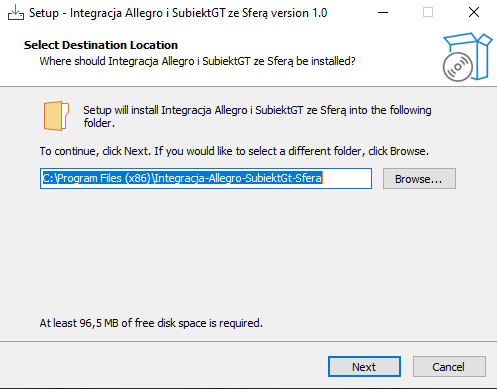
<p>

Następnie można zmienić domyślną nazwę foldera z plikacją w menu start:
<p align="center">
    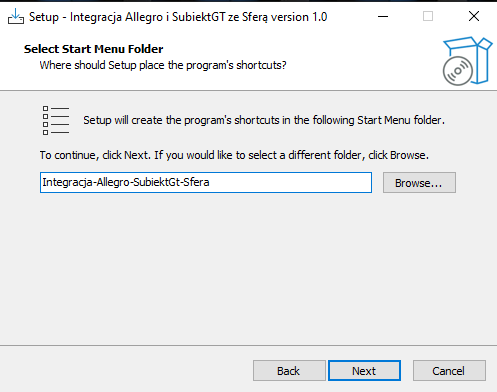
<p>

Poźniej można potwierdzić ustawienia i kliknąć instaluj:
<p align="center">
    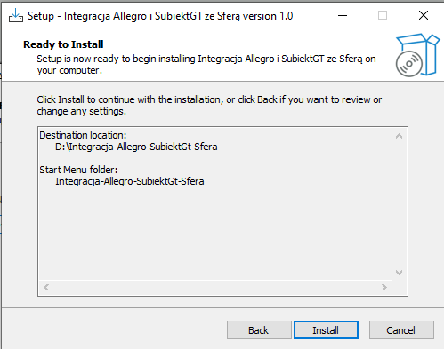
<p>

Po pomyślnym zainstalowaniu aplikacji powinno pojawić się takie okno:
<p align="center">
    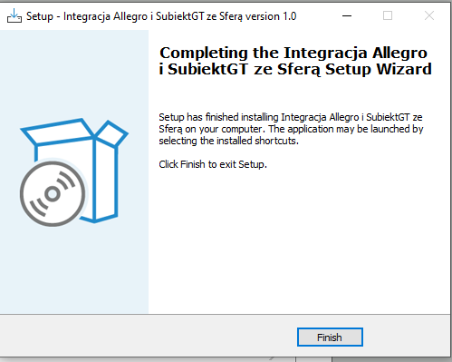
<p>

Dodatkowo powinien być utworzony na pulpicie plik uruchomieniowy aplikacji `Uruchom Integracja Allegro i SubiektGT ze Sferą`. Za pomocą tego pliku możliwe jest proste uruchomienie aplikacji.

Aplikację też można odinstalować poprzez uruchomienie pliku `unins000.exe` w folderze, w którym została zainstalowana aplikacja.

## Po uruchomieniu aplikacji

Po pierwszym uruchomieniu aplikacji powinno pojawić się następujące okno:
<p align="center">
    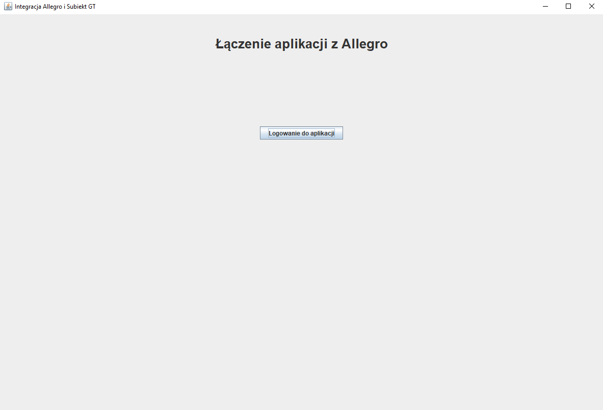
<p>

Aby aplikacja działała poprawnie, należy skonfigurować nakładkę na Sferę.

### Konfiguracja nakładki na Sferę

Należy m.in. podać nazwę bazy danych wykorzystywanej przez SubiektGT oraz nazwę użytkownika w SubiektGT.

#### Metoda 1

Nakładkę na Sferę można skonfigurować poprzez plik `htdocs/config/api-subiekt-gt.ini`.
Wygląda on mniej więcej tak.
```
server = "adres serwera bazy danych Subiekta"

dbuser = "login do bazy danych"

dbpassword = "haslo do bazy danych"

database = "nazwa bazy danych"

id_person = "Imię i nazwisko osoby na fakturze"

operator = "Użytkownik Subiekta np. Szef"

operator_password = "Hasło użytkownika Subiekta"

```

Podano parametry, które prawdopodobnie trzeba będzie skonfigurować.

#### Metoda 2

Drugim sposobem jest skorzystanie ze strony dostarczanej przez autora nakładki na Sferę `http://localhost/public/setup/`.
<p align="center">
    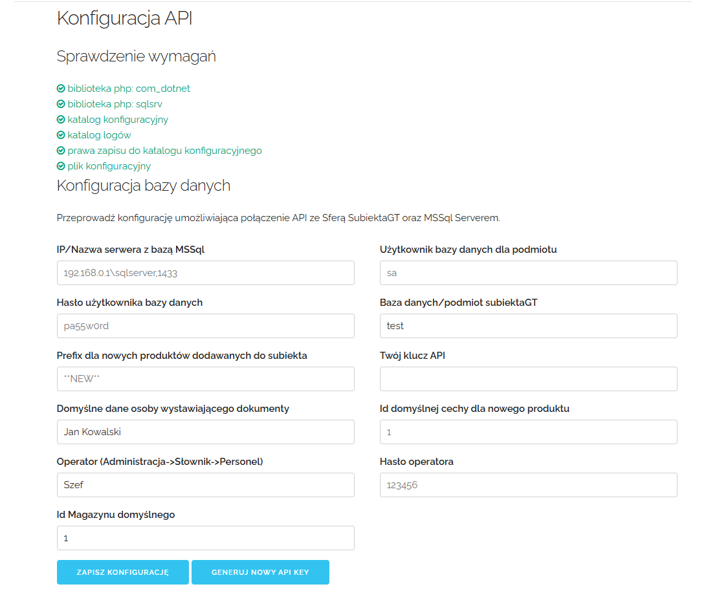
<p>

Wystarczy uzupełnienie tych parametrów, które podano w metodzie 1.

Po skonfigurowaniu parametrów należy kliknąć przycisk Zapisz konfigurację i dzięki temu zostanie uzupełniony plik z metody 1.

Po tym kroku można już przejść do aplikacji integracja.

### Logowanie

Pierwszym krokiem jest zalogowanie się:
<p align="center">
    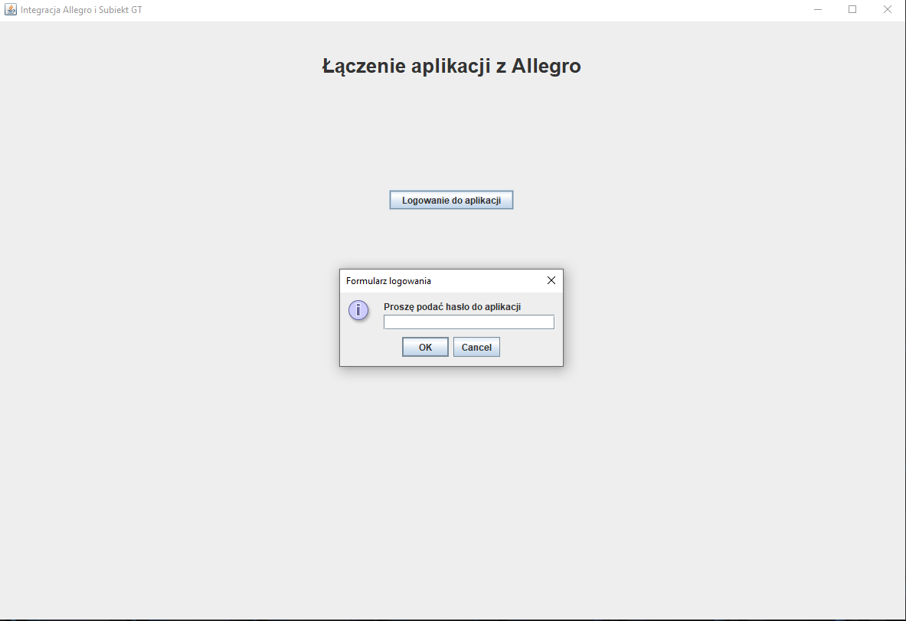
<p>

Do tego celu należy podać hasło do aplikacji. Dla testowej wersji aplikacji hasłem jest `integracja-12234`.

Po pomyślnym logowaniu powinno się pojawić takie okno:
<p align="center">
    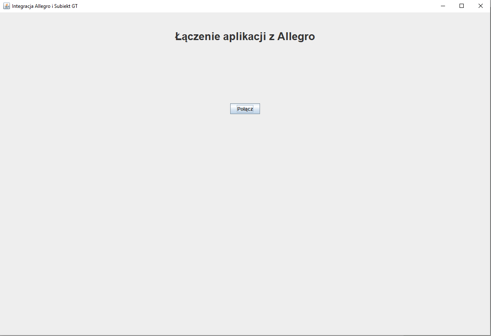
<p>

Następnym krokiem jest połączenie aplikacji z Allegro.

### Połącznie aplikacji z Allegro

Wymagane jest zalogowanie się na konto Allegro, aby aplikacja mogła pobierać zamówienia
z tego konta.

Po naciśnięciu połącz w aplikacji powinno pojawić się następujące okno:
<p align="center">
    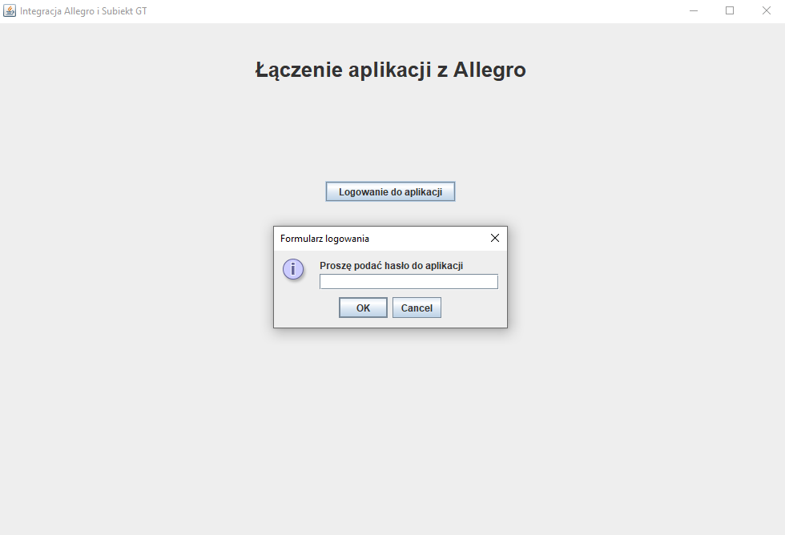
<p>

Po potwierdzeniu komunikatu nastąpi przekierowanie na stronę Allegro:
<p align="center">
    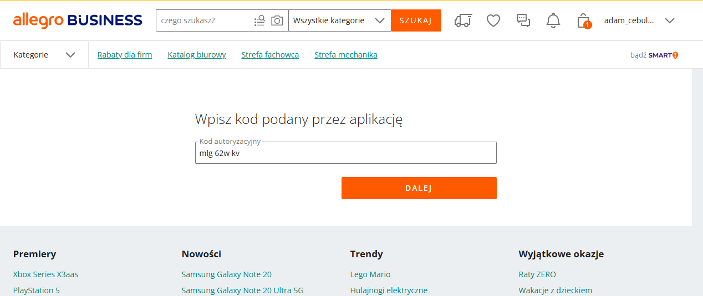
<p>

Wystarczy przejść dalej, gdyż aplikacja automatycznie uzupełniła kod.

Następnie można potwierdzić, czy aplikacja może korzystać z danych wybranego konta oraz
dodatkowo prawdopodobnie będą podane uprawnienia, jakie aplikacja otrzyma po zatwierdzeniu
dostępu.
<p align="center">
    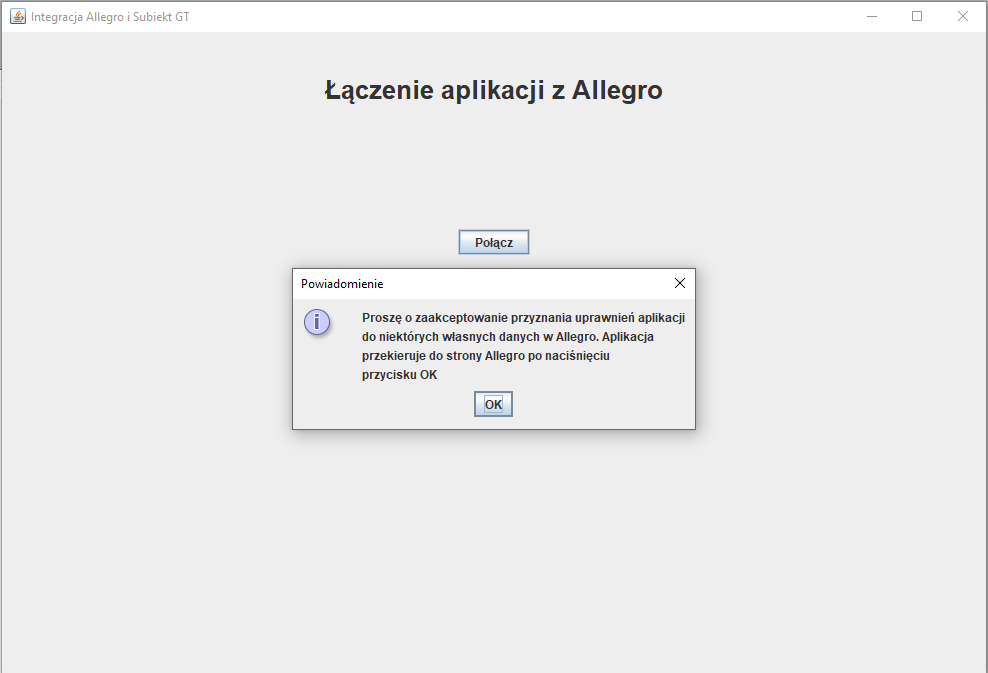
<p>

Po zatwierdzeniu w Allegro powinno pojawić się takie okno:
<p align="center">
    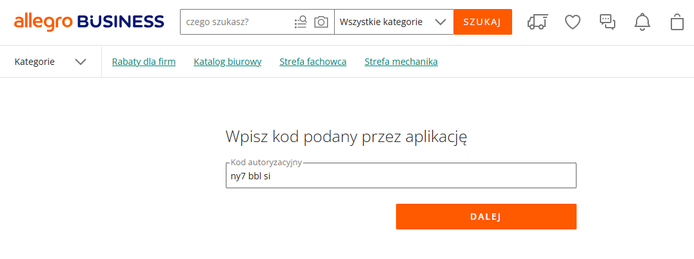
<p>

Teraz wystarczy przejście do aplikacji i kliknięcie Gotowe:
<p align="center">
    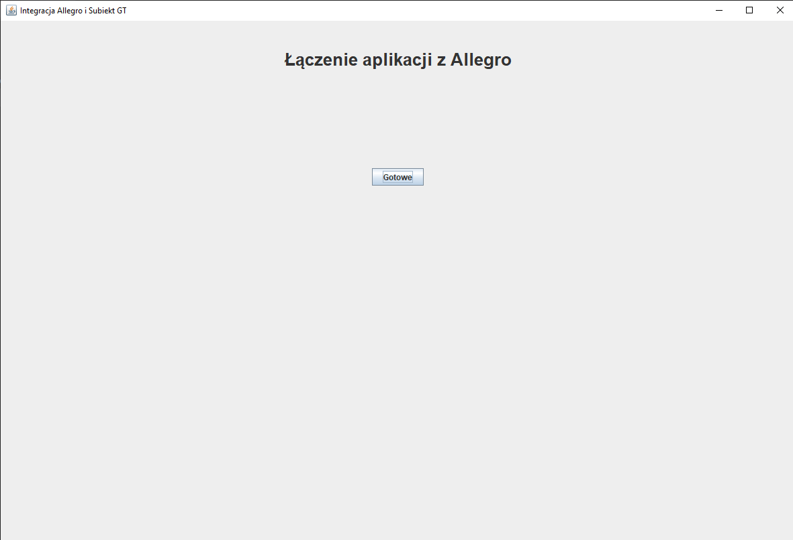
<p>

Po tych krokach powinno się pojawić już okno z zamówieniami:
<p align="center">
    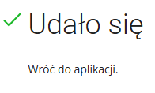
<p>

Aplikacja po tych krokach jest już w pełni funkcjonalna.

## Po zalogowaniu i skonfigurowaniu aplikacji

### Wylogowanie

Po zalogowaniu się na niewłaściwe konto można skorzystać z opcji wylogowania się poprzez wejście w menu Konto:
<p align="center">
    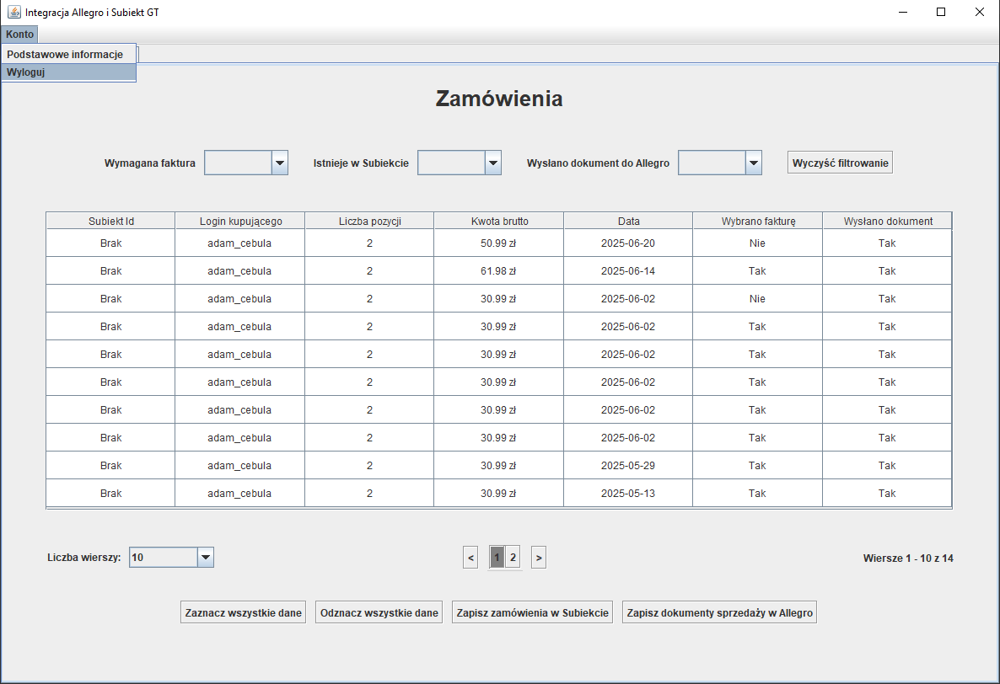
<p>

Po tym kroku będzie można ponownie połączyć aplikację, lecz tym razem np. z innym kontem Allegro.

### Produkty

Sekcja z produktami zawiera publiczne oferty z Allegro wraz z informacjami o ich powiązaniu z towarami i kompletami w Subiekcie:
<p align="center">
    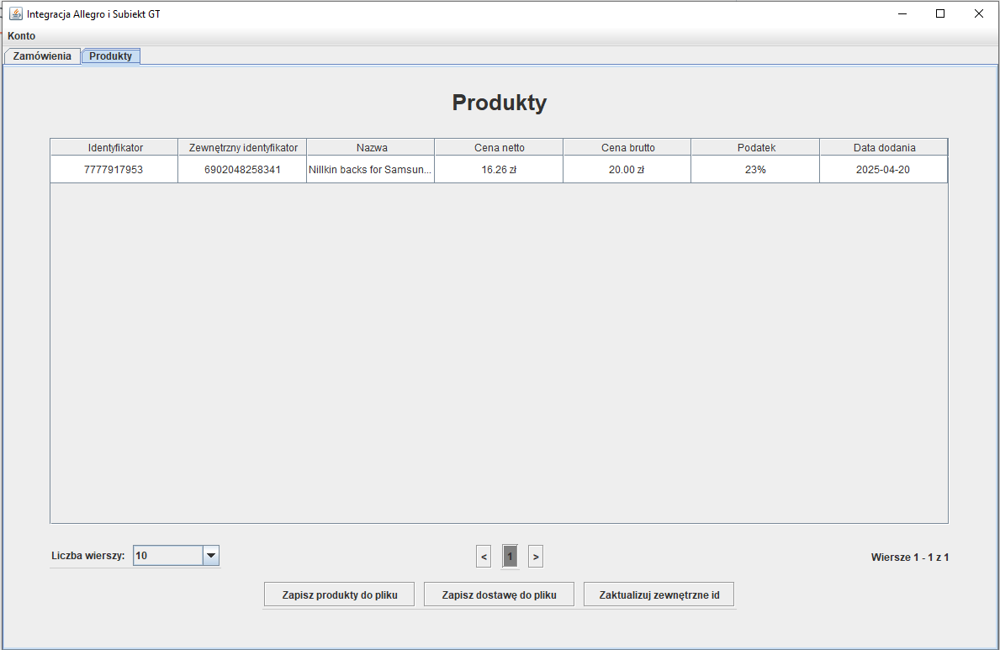
<p>

Możliwe jest wyszukanie konkretnych ofert, zwiększenie liczby ofert na jednej stronie oraz przejście do kolejnej strony.

W tabeli znajdują się najważniejsze informacje o ofertach z Allegro, a szczególnie te związane z integracją z SubiektGT. Najważniejszejszymi parametrami są:
* Number oferty z Allegro,
* Kod producenta produktu z oferty z Allegro,
* Kod paskowy produktu związanego z daną ofertą z Allegro,
* Informacja, czy dana oferta z Allegro zawiera wiele różnych produktów,
* Identyfikator towaru z SubiektGT powiązanego z daną ofertą z Allegro.

#### Zewnętrzny identyfikator

Istotne jest, żeby dla każdej strony z ofertami z Allegro w aplikacji wybrać opcję Zaktualizuj zewnętrzne id. Po tym działaniu, oferty w Allegro będą miały ustawione odpowiednie zewnętrzne identyfikatory. Jest to szczególnie ważne dla ofert zawierających jedynie pojedyncze produkty. Wtenczas zewnętrzy identyfikator tych ofert będzie równy Kod Producenta#Kod paskowy z ich produktów. Jest to ważne, ponieważ gdy pobiera się zamówienia z Allegro, wtenczas brak jest szczegółowych informacji o produktach ofert związanych z danymi zamówieniami. Jednak istotne jest, że pobierane są wewnętrzne identyfikatory ofert i dzięki temu wiadomo jakiego produktu dotyczy dana oferta.

W przypadku ofert zawierających wiele różnych produktów, zewnętrzny identyfikator nie jest wykorzystywany. Zamiast tego brany jest pod uwagę numer oferty wraz z dopiskiem Zestaw np. Zestaw-1234.

#### Integracja z SubiektGT

Jak wspomniano, dla ofert z Allegro z pojedynczymi produktami bardzo istotny jest zewnętrzny identyfikator. Wynika to z tego, że jego dane są wykorzystywane przy próbie wyszukiwania odpowiedniego towaru w SubiektGT. W pierwszej kolejności sprawdzane jest, czy podany kod producenta znajduje się w Symbolu towaru w SubiektGT oraz następnie czy jest on obecny w którejś z linii opisu towaru. W drugiej kolejności sprawdzane jest, czy kod paskowy zgadza się z podstawowym kodem paskowym w jakimś towarze w SubiektGT, jeśli nie, to sprawdzane jest czy kod paskowy znajduje się w którejś z linii w opisie towaru. Jeśli nadal nie znaleziono dopasowania, wtenczas sprawdzane jest, czy numer oferty z Allegro znajduje się w Symbolu albo opisie towaru.

W przypadku ofert z Allegro zawierających wiele różnych produktów sprawdzany jest tylko numer oferty. Sprawdzane jest, czy numer oferty znajduje się w Symbolu albo opisie dla danego towaru. Dodatkowo warto tutaj zaznaczyć, że oferta taka musi być powiązana z kompletem po stronie SubiektGT, czyli towarem zawierającym wiele innych towarów.

Istotne jest, żeby każda oferta z Allegro miała swój odpowiednik w SubiekcieGT. Będzie wiadomo, czy dana oferta jest powiązana z innym towarem albo kompletem w SubiektGT, jeśli w polu Subiekt Id będzie inna wartość niż Brak. Może istnieć wiele ofert z Allegro powiązanych z tylko jednym towarem w SubiektGT.

#### Zapisanie dostawy do pliku

Aby integracja zamówień z Allegro z SubiektGT działała poprawnie, należy dodać wcześniej w SubiektGT usługę dostawa. Wynika to z tego, że aplikacja integracja wybiera tę usługę wtedy, gdy w zamówieniu w Allegro wybrano dostawę. Dostawę tę można zapisać do pliku w aplikacji integracja. Następnie proponuję wykorzystać opcję Operacje-Dodaj na podstawie na stronie z towarami, aby dodać taką usługę w SubiektGT:
<p align="center">
    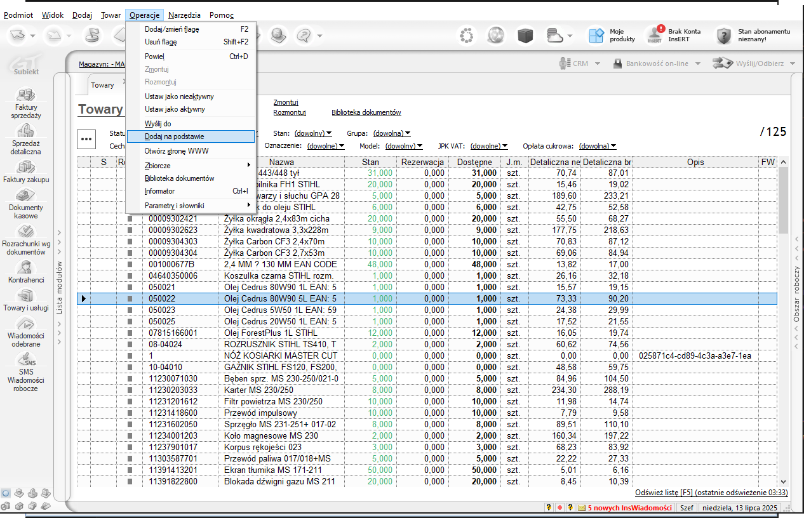
<p>

Następnie należy wybrać plik zawierający dostawę `dostawa.epp` a następnie kliknąć opcję wczytaj:
<p align="center">
    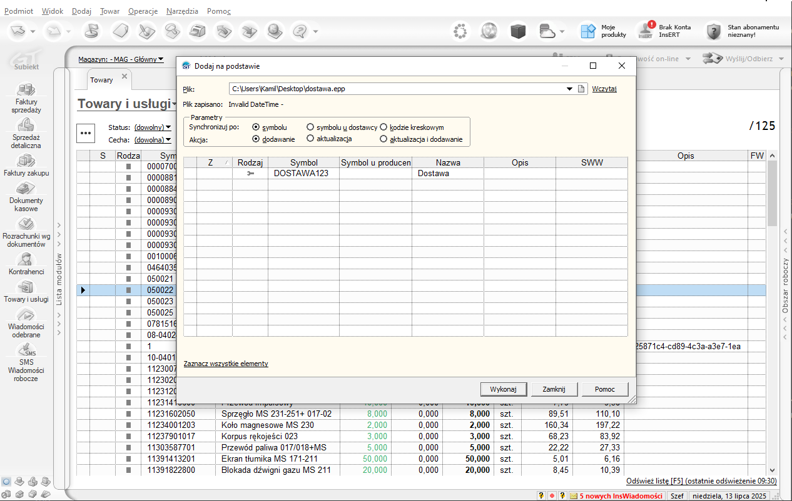
<p>

Kolejnym krokiem jest wybranie dostawy do zapisania i kliknięcie opcji Wykonaj. Po tym działaniu dostawa powinna zostać utworzona w SubiektGT.

#### Zapisywanie produktów do pliku

W przypadku posiadania ofert w Allegro, które nie mają swoich odpowiedników w SubiektGT, można w aplikacji zapisać takie oferty do pliku i wczytać w podobny sposób, jak w przypadku dostawy.

#### Zapisywanie zestawów

Ostatnią opcją w stronie z produktami jest zapisywanie zestawów. Tym razem nie jest potrzebne bazowanie na plikach i po naciśnięciu tego przycisku zostaną zapisane w Subiekcie zestawy obecne na wybranej stronie.

### Zamówienia

#### Wstęp

Przykładowa strona z zamówieniami:
<p align="center">
    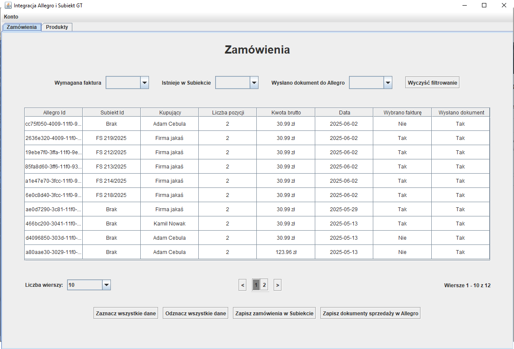
<p>

Pobierane są zamówienia z Allegro, które zostały opłacone przez klientów i jednocześnie nie zostały jeszcze anulowane. Aplikacja wykrywa, czy wybrane zamówienie ma mieć przypisaną fakturę, czy też nie. W pierwszym przypadku w SubiektGT zostanie utworzona faktura sprzedaży, a w drugim stworzony zostanie zwykły paragon.

Najważniejszymi parametrami z perspektywy integracji Allegro z SubiektGT są następujące atrybuty:
* Identyfikator faktury sprzedaży albo zwykłego paragonu w SubiektGT, które są powiązane z danym zamówieniem. Po utworzeniu dokumentu w SubiektGT, identyfikator danego zamówienia jest zapisywany w tym dokumencie w polu Uwagi. Dzięki temu wiadomo, czy dane zamówienie zostało już zapisane w SubiektGT,
* Następnym ważnym parametrem jest pole, czy wybrano fakturę. Dzięki temu zostanie utworzona albo faktura sprzedaży albo zwykły paragon,
* Ostatnim polem jest wartość określająca, czy przypisano do danego zamówienia z Allegro dokument potwierdzający sprzedaż.

Zamówienia można filtrować, np. wyświetlić tylko zamówienia, dla których wymagane są faktury. Dodatkowo można zmienić liczbę zamówień dostępnych na jednej stronie oraz zmienić stronę.

#### Tworzenie zamówień

##### Wybór zamówień

W aplikacji aby utworzyć dokumenty w SubiektGT na podstawie zamówień z Allegro, należy na początku wybrać zamówienia, które mają zostać przetworzone. Można albo zaznaczyć całą stronę poprzez opcję Zaznacz wszystkie dane albo spróbować ręcznie wybrać interesujące zamówienia poprzez znaznaczenie ich myszką albo pojedyncze zaznaczanie razem z trzymaniem przycisku CTRL na klawiaturze.

##### Zapisywanie zamówień

Następnym krokiem jest naciśnięcie przycisku Zapisz zamówienia w Subiekcie. Następnie po wykonaniu operacji zostanie wyświetlony komunikat informujący o tym, ile udało się utworzyć dokumentów w SubiektGT:
<p align="center">
    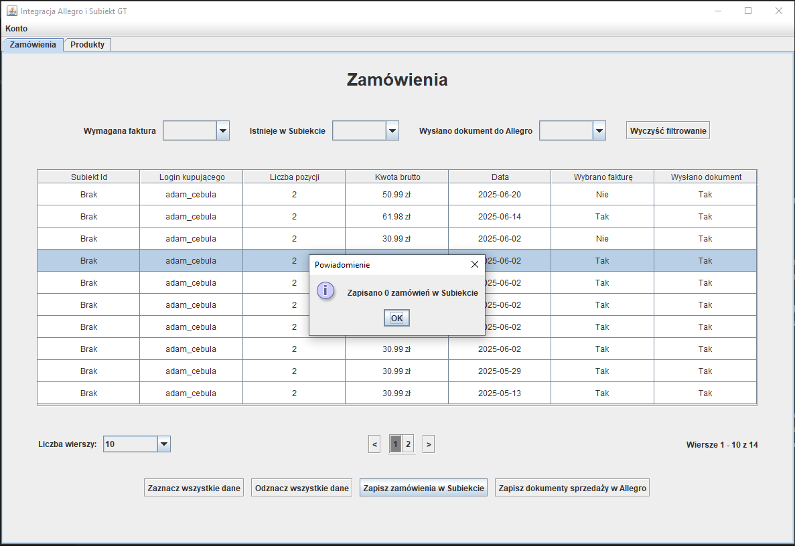
<p>

Następnie w przypadku nieudanego utworzenia danego zamówienia, wyświetlony zostanie komunikat, dlaczego to zamówienie nie zostało utworzone. Najczęstszym powodem jest brak dopasowania ofert z Allegro i towarów w SubiektGT np. niezgodne kody producenta.
<p align="center">
    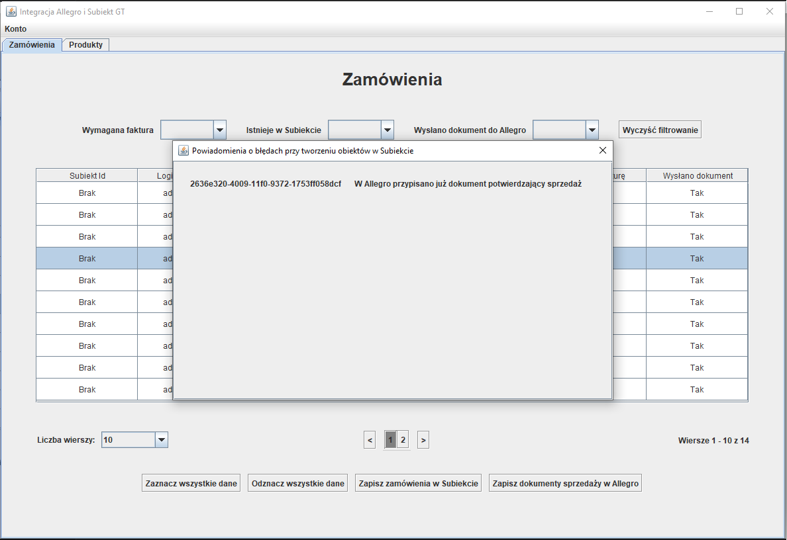
<p>

Wyświetlana jest lista identyfikatorów zamówień wraz z powodami nieutworzenia ich w Subiekcie.

#### Zapisywanie dokumentów sprzedaży w Allegro

Po utworzeniu faktury sprzedaży albo zwykłego paragonu dla danego zamówienia z Allegro, możliwe jest późniejsze zapisanie dla tego zamówienia dokumentu potwierdzającego sprzedaż. Po kliknięciu opcji Zapisz dokumenty sprzedaży w Allegro dla wybranych zamówień z Allegro, zostaną przypisane do tych zamówień dokumenty otrzymane z SubiektGT w formacie pdf.
