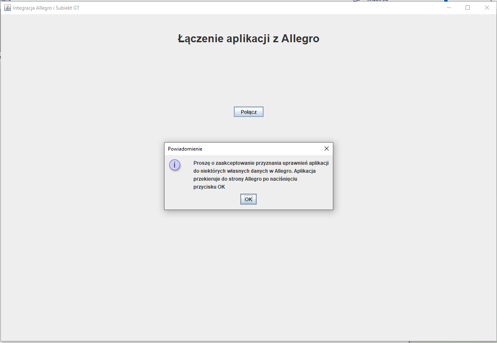
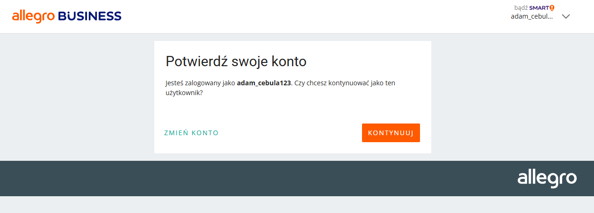
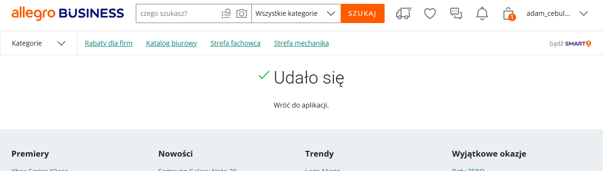
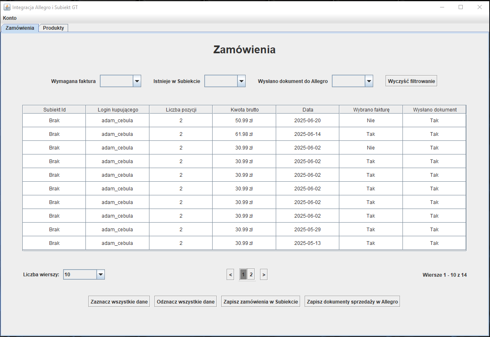

# Integracja Allegro i SubiektGT ze Sferą - zamówienia, faktury sprzedaży, paragony i produkty

## Wstęp

### Wprowadzenie

Repozytorium dotyczy aplikacji umożliwiającej przede wszystkim pobranie zamówień z Allegro i późniejsze zapisanie ich w Subiekcie w postaci faktur sprzedaży albo 
zwykłych paragonów. W aplikacji można zaznaczyć wiele zamówień pobranych z Allegro i następnie jednym kliknięciem dodawane są do Subiekta faktury albo zwykłe paragony. 
Dodatkowo po utworzeniu zamówień Allegro w Subiekcie w formie faktury albo paragonu można jeszcze w aplikacji Integracja dla wybranych zamówień w Allegro przypisać dokumenty sprzedaży otrzymane
 w Subiekt GT. Aplikacja wspiera oferty z Allegro w wielu konfiguracjach:
* Jeden produkt,
* Zestaw jednego produktu np. 10 sztuk produktu,
* Zestaw wielu produktów.

Dodatkowo w aplikacji Integracja można przeglądać oferty obecne w Allegro wraz z informacjami, czy znaleziono analogiczny produkt w Subiekcie. Również w razie
potrzeby, w aplikacji można zapisać oferty pobrane z Allegro do pliku i następnie można te oferty szybko dodać do Subiekt GT w postaci towaru albo zestawu towarów.

### Sfera

#### Wprowadzenie
Aplikacja Integracja korzysta z dodatku Sfera do Subiekt GT i dzięki temu można szybko dodać pożądane dokumenty do Subiekta. Wtyczka Sfera umożliwia uruchomienie 
w Subiekcie kanału komunikacyjnego, poprzez który aplikacje mogą się w sposób bezpośredni komunikować z Subiektem. Technicznie otwierane jest API typu COM, które 
jest technologią najczęściej używaną w C#. Dodatek mocno usprawnia integrację, gdyż nie trzeba bazować na plikach i opcji Dodaj na podstawie. Niestety mechanizm ten jest dodatkowo płatny, lecz chociaż zakup jest jednorazowy.

#### Nakładka na Sferę

Jak wspomniałem Sfera jest raczej związana z językiem C#. Ja niestety nie znam za bardzo tego języka i ograniczyłem się do Javy. Dlatego wykorzystałem nakładkę 
na Sfere napisaną przez kogoś innego w php. Wtyczka jest zamieszczona na[repozytorium GitHub Lukegpl](https://github.com/Lukegpl/api-subiekt-gt?tab=readme-ov-file).

Nakładka ta okazała się całkiem dobra. Przede wszystkim używa REST i JSON oraz jest dosyć dobrze 
[udokomentowana](https://github.com/Lukegpl/api-subiekt-gt/wiki/API-Dokumentacja-v.-1.0). Są szczegółowe informacje o realizowanych funkcjach np. jakie dane są wymagane 
dla poszczególnych endpointów oraz co prawdopodobnie będzie zwrócone. Niestety musiałem też trochę przerobić kod tej nakładki, aby spełniała moje potrzeby 
np. wprowadziłem tworzenie klienta jednorazowego przy zapisywaniu faktur sprzedaży i zwykłych paragonów, a we wcześniejszej wersji nakładki,
klienci musieli już istnieć w Subiekcie przed dodaniem nowych obiektów. Dodatkowo w nakładce dodanie faktury sprzedaży musiało być poprzedzone dodaniem 
zamówienia od klienta. Również to zmieniłem i u mnie mogą być odrazu dodane dokumenty do Subiekta.

### Wykorzystanie aplikacji

Aplikacja jest wykorzystywana produkcyjnie przez mojego znajomego zajmującego się sprzedażą w Allegro i zarządzaniem finansami i magazynem w Subiekt GT. Na chwile
obecną jest zadowolony i w razie czego wprowadzam drobne poprawki.

Ze względów bezpieczeństwa aplikacja ta zamieszczona na tym repozytorium operuje na środowisku testowym Allegro Sandbox, ale również mam wersję aplikacji
przeznaczoną dla standardowego środowiska Allegro (produkcyjnego), która jest aktualnie wykorzystywana przez mojego znajomego. Wersja produkcyjna jest
 niepubliczna. W razie potrzeby skorzystania z tej aplikacji na poważnie proszę napisać na mój adres e-mail kamdyw@wp.pl i chętnie przekażę wersję produkcyjną.

### Technologie

* Java,
* Swing,
* Maven,
* REST
* JSON,
* Sfera
* COM,
* Php
* JWT,
* OAuth 2.0,
* Git.

## Przed uruchomieniem aplikacji

### Wymagane narzędzia

#### Java

Do uruchomienia aplikacji potrzebne będzie zainstalowanie środowiska uruchomieniowego Javy (JRE) w wersji 17 albo późniejszej, gdyż moja aplikacja została napisana w Javie.

#### Sfera

Jak już wcześniej wspomniałem, aplikacja ta wykorzystuje Sferę, dlatego aby móc użytkować aplikację, niezbędne jest aktywowanie wtyczki Sfera w SubiektGT. Jest to wymagane mimo, iż aplikacja korzysta ze Sfery poprzez nakładkę.

### Instalacja

Dla aplikacji stworzyłem instalator `Integracja-Allegro-SubiektGt-Sfera.exe`, dzięki któremu można w prosty sposób zainstalować wszystkie wymagane składniki do działania aplikacji.

Na początku potrzebne jest podanie lokalizacji instalacji:
<p align="center">
    
<p>

Następnie można zmienić domyślną nazwę foldera z plikacją w menu start:
<p align="center">
    
<p>

Poźniej można potwierdzić ustawienia i kliknąć instaluj:
<p align="center">
    
<p>

Po pomyślnym zainstalowaniu aplikacji powinno pojawić się takie okno:
<p align="center">
    
<p>

Dodatkowo powinien być utworzony na pulpicie plik uruchomieniowy aplikacji `Uruchom Integracja Allegro i SubiektGT ze Sferą`. Za pomocą tego pliku możliwe jest proste uruchomienie aplikacji.

Aplikację też można odinstalować poprzez uruchomienie pliku `unins000.exe` w folderze, w którym została zainstalowana aplikacja.

### Po uruchomieniu aplikacji

Po pierwszym uruchomieniu aplikacji powinno pojawić się następujące okno:
<p align="center">
    
<p>

Aby aplikacja działała poprawnie, należy skonfigurować nakładkę na Sferę.

#### Konfiguracja nakładki na Sferę

Należy m.in. podać nazwę bazy danych wykorzystywanej przez SubiektGT oraz nazwę użytkownika w SubiektGT.

##### Metoda 1

Nakładkę na Sferę można skonfigurować poprzez plik `htdocs/config/api-subiekt-gt.ini`.
Wygląda on mniej więcej tak.
```
server = "adres serwera bazy danych Subiekta"

dbuser = "login do bazy danych"

dbpassword = "haslo do bazy danych"

database = "nazwa bazy danych"

id_person = "Imię i nazwisko osoby na fakturze"

operator = "Użytkownik Subiekta np. Szef"

operator_password = "Hasło użytkownika Subiekta"

```

Podano parametry, które prawdopodobnie trzeba będzie skonfigurować.

##### Metoda 2

Drugim sposobem jest skorzystanie ze strony dostarczanej przez autora nakładki na Sferę `http://localhost/public/setup/`.
<p align="center">
    
<p>

Wystarczy uzupełnienie tych parametrów, które podano w metodzie 1.

Po skonfigurowaniu parametrów należy kliknąć przycisk Zapisz konfigurację i dzięki temu zostanie uzupełniony plik z metody 1.

Po tym kroku można już przejść do aplikacji integracja.

#### Logowanie

Pierwszym krokiem jest zalogowanie się. Do tego celu należy podać hasło do aplikacji. Dla testowej wersji aplikacji hasłem jest `integracja-12234`.

Po pomyślnym logowaniu powinno się pojawić takie okno:
<p align="center">
    
<p>

Następnym krokiem jest połączenie aplikacji z Allegro.

#### Połącznie aplikacji z Allegro

Wymagane jest zalogowanie się na konto Allegro, aby aplikacja mogła pobierać zamówienia
z tego konta.

Po naciśnięciu połącz w aplikacji powinno pojawić się następujące okno:
<p align="center">
    
<p>

Po potwierdzeniu komunikatu nastąpi przekierowanie na stronę Allegro:
<p align="center">
    
<p>

Wystarczy przejść dalej, gdyż aplikacja automatycznie uzupełniła kod.

Następnie można potwierdzić, czy aplikacja może korzystać z danych wybranego konta oraz
dodatkowo prawdopodobnie będą podane uprawnienia, jakie aplikacja otrzyma po zatwierdzeniu
dostępu.
<p align="center">
    
<p>

Po zatwierdzeniu w Allegro powinno pojawić się takie okno:
<p align="center">
    
<p>

Teraz wystarczy przejście do aplikacji i kliknięcie Gotowe:
<p align="center">
    
<p>

Po tych krokach powinno się pojawić już okno z zamówieniami:
<p align="center">
    
<p>

Aplikacja po tych krokach jest już w pełni funkcjonalna.


